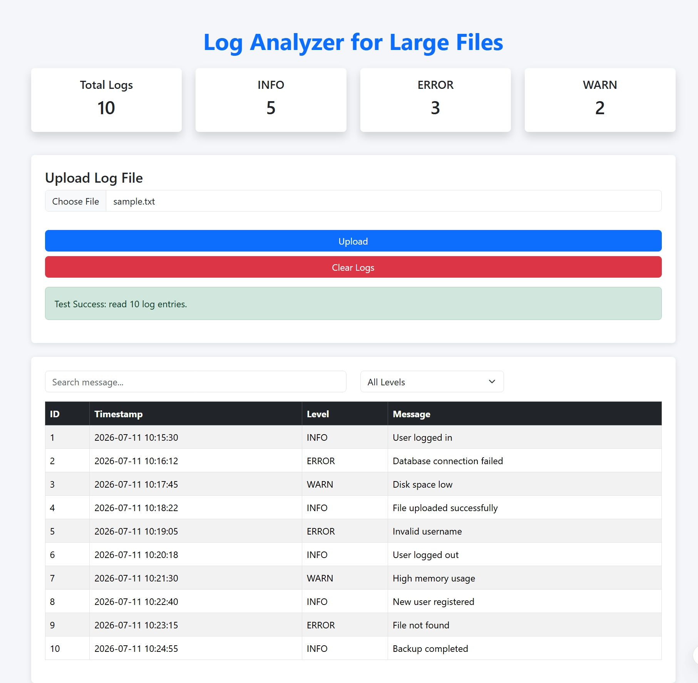
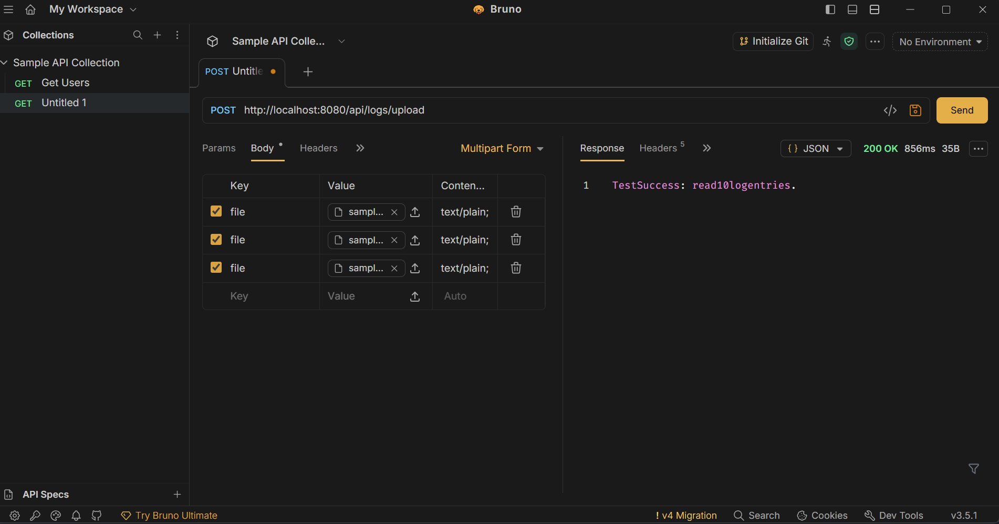
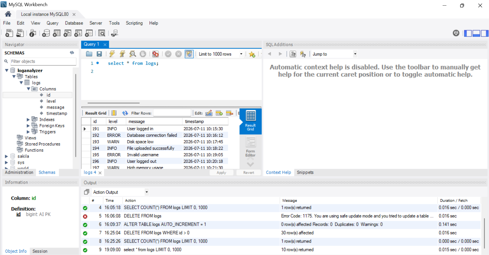

# Project Title

**Log Analyzer for Large Files**

---

# Objective

The Log Analyzer for Large Files is a full-stack web application developed to simplify the analysis of large log files. The application allows users to upload log files, automatically parses each log entry, stores the data in a MySQL database, and provides useful statistics along with search and filtering capabilities. This project demonstrates backend development using Spring Boot, database integration with MySQL, REST API development, and frontend development using HTML, CSS, JavaScript, and Bootstrap.

---

# Technology Stack

## Backend
- Java 17
- Spring Boot
- Spring Data JPA
- Maven

## Frontend
- HTML5
- CSS3
- JavaScript
- Bootstrap 5

## Database
- MySQL

## Tools
- VS Code
- MySQL Workbench
- Bruno API Client
- Git & GitHub

---

# Setup Instructions

## 1. Clone the Repository

```bash
git clone https://github.com/Riddhi-Daspute/LogAnalyzer.git
```

## 2. Open the Project

Open the project in **VS Code** or **IntelliJ IDEA**.

## 3. Create Database

Create a MySQL database named:

```sql
CREATE DATABASE loganalyzer;
```

## 4. Configure Database

Update the following properties inside `src/main/resources/application.properties`:

```properties
spring.datasource.url=jdbc:mysql://localhost:3306/loganalyzer
spring.datasource.username=YOUR_USERNAME
spring.datasource.password=YOUR_PASSWORD
```

## 5. Run the Application

```bash
mvn spring-boot:run
```

## 6. Open in Browser

```
http://localhost:8080
```

---

# Screenshots

## Dashboard



## API Testing (Bruno)



## MySQL Database



---

# Live Link (Deployed Project)

**Not Deployed (Runs Locally)**

---

# Features

- Upload large log files
- Parse log entries automatically
- Store logs in MySQL database
- View log statistics
- Search log messages
- Filter logs by log level
- Display logs in a responsive table
- Clear all stored logs

---

# Author

**Riddhi Kuntal Daspute**

MCA Student